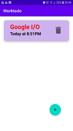
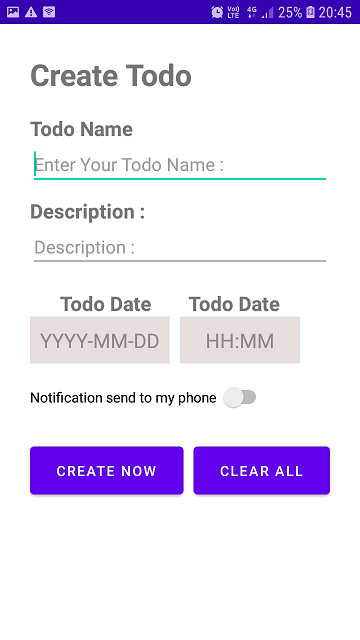
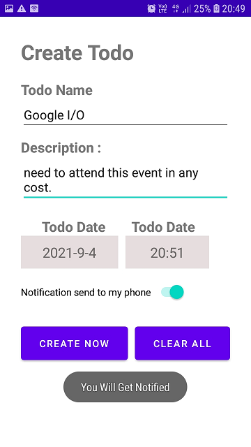
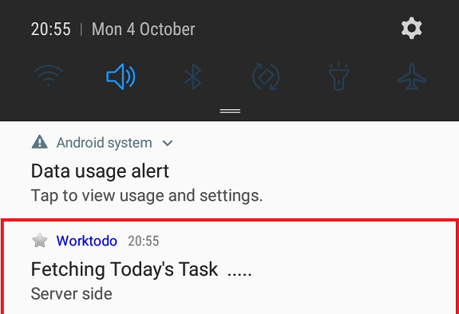
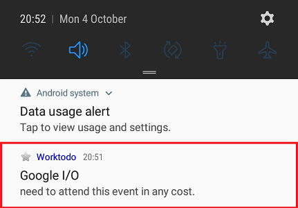

# Worktodo 
this application is build for reminding user all day task to user at specified time and date.

# Features of Worktodo app

1. you can save your today task
2. you get notified by Worktodo app by sending notification (IN-App Notification)
3. you can save your future task also in Worktodo app .
4. you can schedule your future task also . so according to date the app will fetch and show task to Worktodo app home screen

# Screen 
## Home screen
 &nbsp;
by click on  you get to create todo screen
## Creating todo task screen
 &nbsp;  &nbsp;
## Notification fetching from server at 12:00 AM image
 &nbsp;
## Notification of task todo 
 &nbsp;

# TechStack i used
 &nbsp; &nbsp;
 &nbsp; &nbsp;

